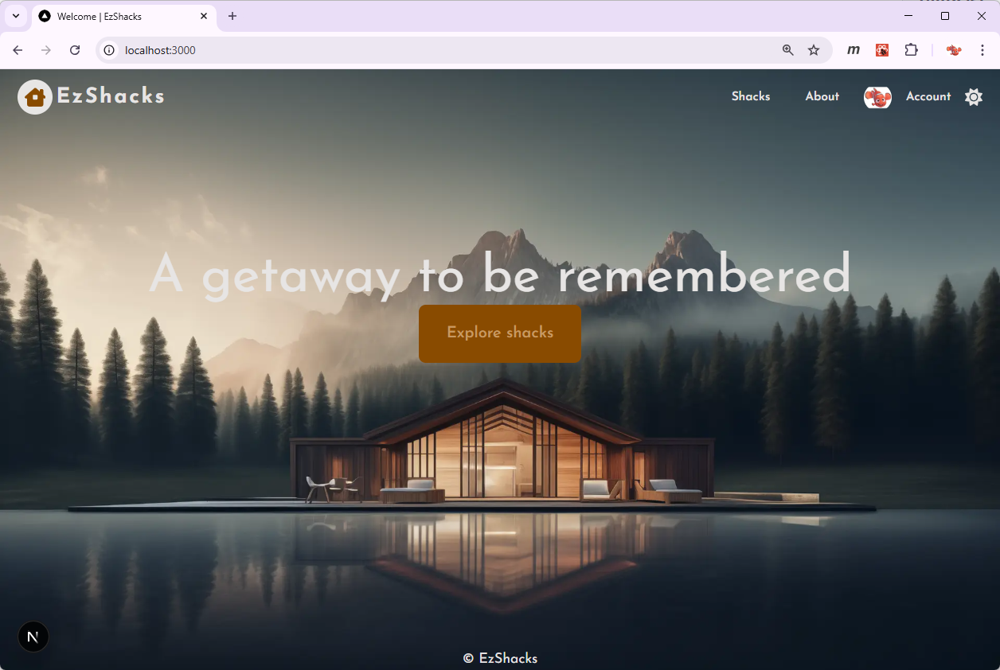
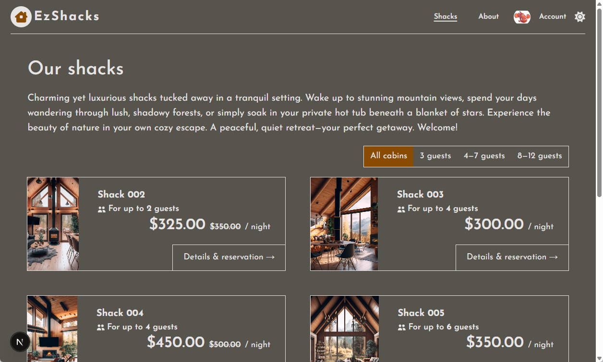
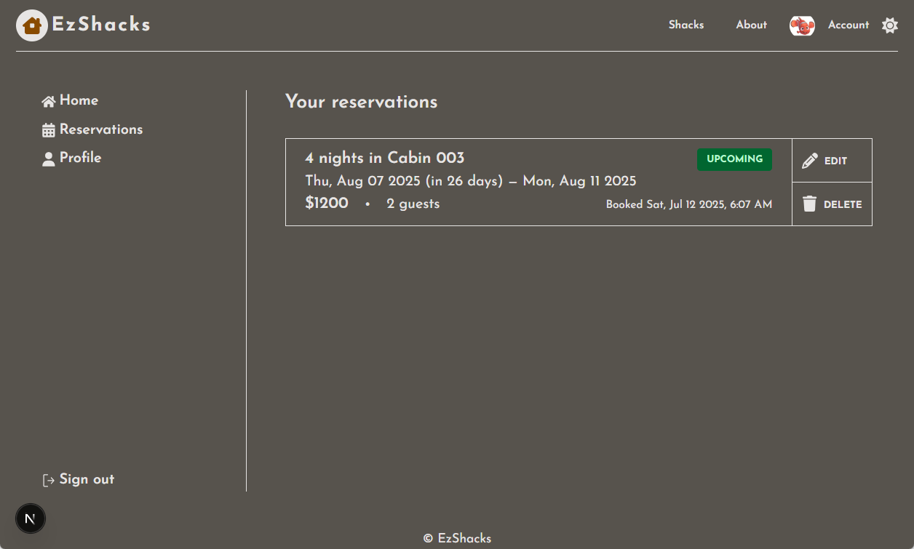
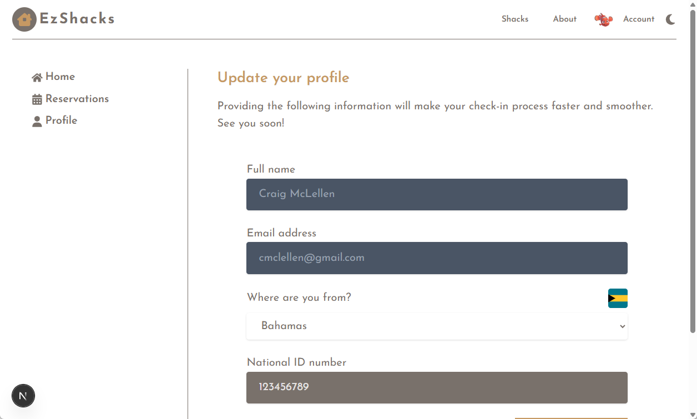

# EzShacks

## Overview

I wanted to try out NextJs and created a little site for reserving holiday accommodation.

Followed a very good tutorials on Udemy by Jonas Schmedtmann that helped me understand the core concepts, etc. The web app uses Superbase behind the scenes and Google for authentication. It's configured to deploy to Vercel on commits made to the repo.

## Screenshots

Just a couple screenshots I took of the app running locally on my machine.

### Landing page

### Shack listing

### Reservation listing

### User profile

